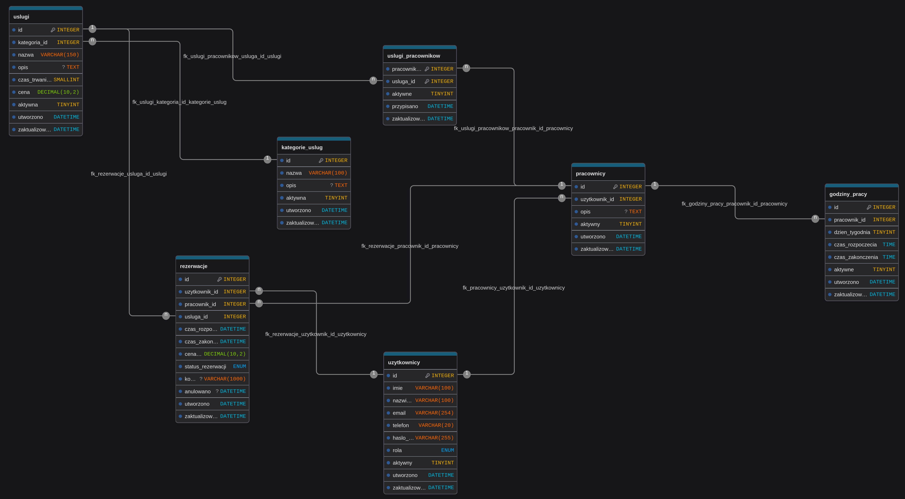

# WeFixIT

System rezerwacji dla serwisu komputerowego. Obsługuje klientów, pracowników i administratorów.

## Spis treści

- [Technologie](#Technologie)
- [Baza danych](#Baza-danych)
- [Zakres projektu](#zakres-projektu)
- [Wymagania](#wymagania)
- [Uruchomienie przez Docker](#uruchomienie-przez-docker)
- [Uruchomienie przez XAMPP](#uruchomienie-przez-xampp)
- [Autorzy](#Autorzy)

## Technologie
Projekt wykorzystuje następujące technologie:
- PHP 8.2 + Apache, proceduralne MySQLi
- MariaDB 11.4
- HTML5, Tailwind CSS 4.3.3 standalone CLI, vanilla JS
- Docker Compose v2, kompatybilność XAMPP

## Baza danych
Wykorzystywana jest baza danych MariaDB. Pusta wersja znajduje się w pliku [database-czysta.sql](database/database-czysta.sql), a wersja z danymi testowymi w [database.sql](database/database.sql).

Poniżej znajduje się diagram wykorzystywanej bazy danych.



### Wersja pusta
Pusta edycja bazy danych jak sama nazwa wskazuje nie zawiera żadnych danych w sobie. Zalecane użycie w środowisku produkcyjnym.

### Wersja testowa
Testowa edycja bazy danych zawiera wszystko co wersja pusta plus dane testowe. Zalecana ona jest do użycia w celach testowych.

#### Konta testowe

| Rola | Imię i nazwisko | E-mail | Hasło |
|------|-----------------|--------|-------|
| Administrator | Administrator Systemu | `admin@wefixit.pl` | `haslo123` |
| Pracownik | Tomasz Serwisant | `tomasz.serwisant@wefixit.pl` | `haslo123` |
| Pracownik | Marcin Elektronik | `marcin.elektronik@wefixit.pl` | `haslo123` |
| Klient | Jan Kowalski | `jan.kowalski@example.com` | `haslo123` |
| Klient | Anna Nowak | `anna.nowak@example.com` | `haslo123` |
| Klient | Piotr Wiśniewski | `piotr.wisniewski@example.com` | `haslo123` |

## Zakres projektu

WeFixIT to system rezerwacji dla serwisu komputerowego z trzema rolami: klient, pracownik, administrator.

### Zrealizowano w Etapie 1

- Schemat bazy MariaDB 11.4: 7 tabel (`uzytkownicy`, `pracownicy`, `kategorie_uslug`, `uslugi`, `uslugi_pracownikow`, `godziny_pracy`, `rezerwacje`).
- Relacje 1:N oraz relacja N:M pracownik–usługa przez `uslugi_pracownikow`.
- Integralność: klucze obce, `UNIQUE` na e-mail, `CHECK` na ceny / czasy / statusy, `ON DELETE RESTRICT`.
- Diagram ERD: `database-diagram-WeFixIT.png`.
- Dane testowe: 1 administrator, 2 pracowników, 3 klientów, usługi, grafik i rezerwacje.
- Środowisko uruchomieniowe: Docker Compose dev + prod oraz instrukcja pod XAMPP.

### Planowane w Etapie 2 - Użytkownicy i logowanie

- Rejestracja konta klienta z walidacją po stronie serwera.
- Logowanie i wylogowanie z obsługą sesji.
- Podział na role: klient, pracownik, administrator.
- Ochrona stron i endpointów przed dostępem bez roli / sesji.
- Profil użytkownika: podgląd i edycja podstawowych danych.

## Wymagania

Do uruchomienia aplikacji należy wybrać jedną z poniższych metod:

- Docker z obsługą Compose,
- XAMPP z Apache, PHP i MySQL.

## Uruchomienie przez Docker

Docker uruchamia aplikację razem z serwerem MariaDB oraz automatycznie ładuje testową bazę danych.

1. Sklonuj repozytorium i przejdź do jego katalogu:

   ```bash
   git clone https://github.com/Mord0reK/WeFixIT.git
   cd WeFixIT
   ```

2. Utwórz plik `.env` na podstawie `.env.example` i w razie potrzeby zmień hasła:

   ```bash
   cp .env.example .env
   ```

3. Zbuduj obrazy i uruchom kontenery:

   ```bash
   docker compose -f docker/docker-compose.dev.yml up --build
   ```

4. Otwórz aplikację w przeglądarce: [http://localhost:8080](http://localhost:8080).

Aby zatrzymać aplikację, użyj `Ctrl+C` albo uruchom:

```bash
docker compose -f docker/docker-compose.dev.yml down
```

Baza danych jest przechowywana w wolumenie Dockera. Aby rozpocząć od nowej bazy i ponownie załadować dane testowe, usuń także wolumen:

```bash
docker compose -f docker/docker-compose.dev.yml down -v
docker compose -f docker/docker-compose.dev.yml up --build
```

## Uruchomienie przez XAMPP

Docelowo uruchomienie przez XAMPP będzie wyglądało następująco:

1. Pobierz ZIP aplikacji z sekcji **Releases** na GitHubie.
2. Rozpakuj go w katalogu `htdocs`.
3. Uruchom Apache i MySQL w panelu XAMPP.
4. Otwórz aplikację pod adresem `http://localhost/WeFixIT`.

ZIP z release będzie zawierał gotową wersję aplikacji i nie będzie zawierał plików narzędzi deweloperskich, takich jak konfiguracja CodeRabbit.

### Obecny sposób uruchomienia

Aktualna wersja repozytorium nie ma jeszcze automatycznej konfiguracji połączenia z bazą dla XAMPP. Przed użyciem tej metody należy jednorazowo:

1. Zainstalować XAMPP i uruchomić moduły **Apache** oraz **MySQL**.
2. Rozpakować projekt do `C:\xampp\htdocs\WeFixIT` (Windows) albo odpowiednika katalogu `htdocs` na danym systemie.
3. Otworzyć [phpMyAdmin](http://localhost/phpmyadmin), utworzyć bazę `wefixit` i zaimportować plik [database.sql](database/database.sql). Na potrzeby produkcyjne można użyć [database-czysta.sql](database/database-czysta.sql).
4. W pliku `index.php` zmienić host bazy danych z `mariadb` na `localhost`:

   ```php
   $db = mysqli_connect('localhost', 'root', '', 'wefixit');
   ```

   Jeśli konto MySQL `root` ma ustawione hasło, należy wpisać je zamiast pustej wartości.

5. Otworzyć aplikację pod adresem [http://localhost/WeFixIT](http://localhost/WeFixIT).

Instrukcja z jednym gotowym ZIP-em z sekcji **Releases** będzie obowiązywać po przygotowaniu release oraz dostosowaniu konfiguracji bazy do środowiska XAMPP. Automatyczne tworzenie release przez GitHub Actions nie jest obecnie skonfigurowane.

## Autorzy

> - [JanDziaslo](https://github.com/JanDziaslo) (Bartosz N.)
>
> - [Mord0reK](https://github.com/Mord0reK) (Marcel S.)
